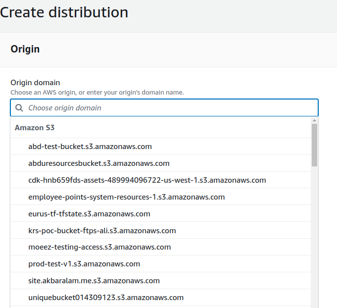
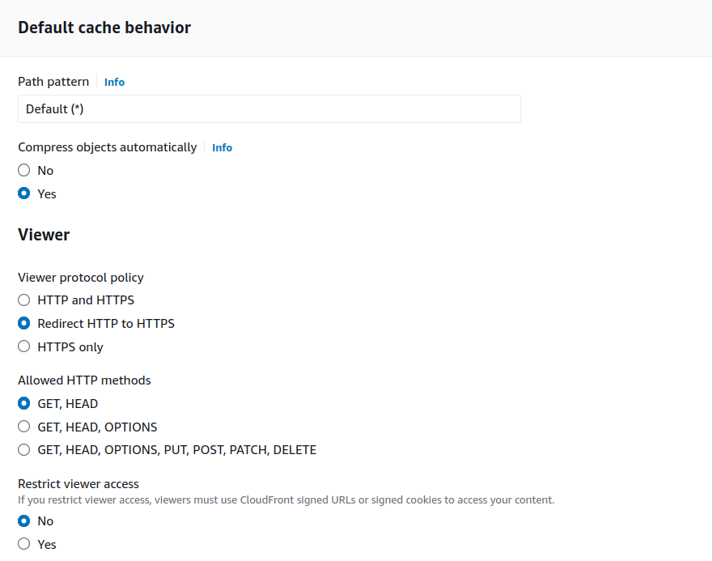
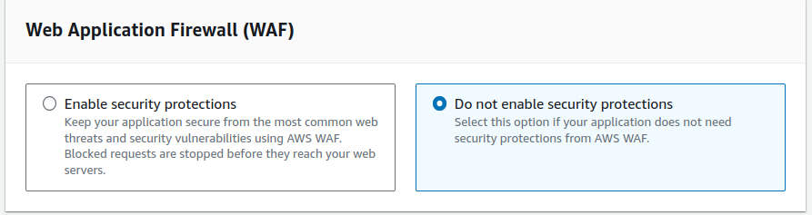
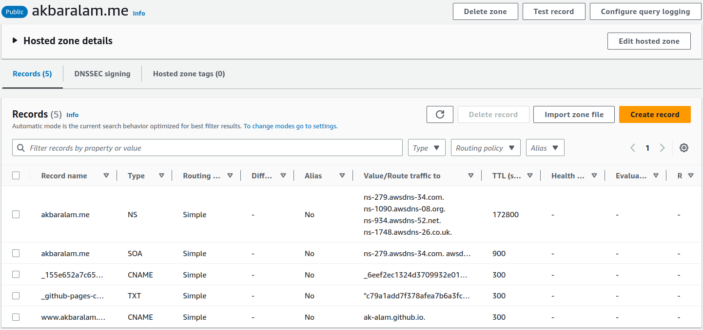
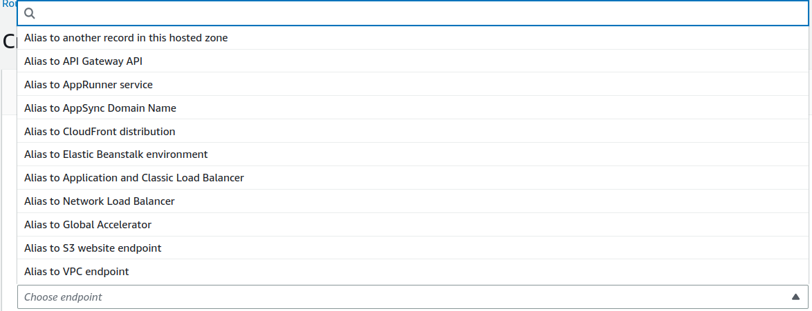

## Week1 Challenge

### Project Description
Host a static website on AWS or Azure or GCP and implement CICD S3, CloudFront, Route53 Azure storage, Azure CDN, DNS Cloud storage LB, Cloud CDN


### Project Deliverables:
* Architecture diagram
* A blog for the steps /Github Readme file.
* screen recording or live website


Hi, I'm Akbar a DevOps engineer and I will be joining 10WeeksOfCloudOps Challenge and in our week 1 we will be deploy a static website to AWS and implement a CI/CD.


## Architecure 
Write about the project architecure


## Folowing are the steps to create S3 bucket and enable static site hosting.

* Create a s3 bucket. Bucket name should be your domain name. e.g "www.example.com"
* Select your appropiate region or leave as default region.


* When creating a bucket by default public access is block make sure to uncheck it.

* Onces your bucket is created, select your bucket and go to properties section of your bucket. Scroll down to bottom, edit static website hosting.
  * Static website hosting -> enable
  * Hosting Type -> Host a static website
  * index document -> index.html
The remaining configuration I'm skipping because I don't have any custom error document and redirection rules.


* We need a IAM policy to make object inside buckets are publicly accessable. Open bucket go to permission, edit bucket policy and past the below IAM policy and make sure to change Bucket-Name from policy to your own bucket name which in our case is www.example.com 

```bash
{
    "Version": "2012-10-17",
    "Statement": [
        {
            "Sid": "PublicReadGetObject",
            "Effect": "Allow",
            "Principal": "*",
            "Action": [
                "s3:GetObject"
            ],
            "Resource": [
                "arn:aws:s3:::Bucket-Name/*"
            ]
        }
    ]
}
```

**NOTE** We need to create 2 buckets www.example.com and example.com. I'm using example.com bucket for redirection to our main bucket www.example.com so whenever some type example.com it will serve our website and whenever someone type www.domain-name.com it will redirect to domain-name.com and server the contents from there.

* Creating bucket example.com 
* open bucket example.com and select your bucket and go to properties section of your bucket. Scroll down to bottom, edit static website hosting.
  * Static website hosting -> enable
  * Hosting Type -> Redirect requests for an object
  * Host name -> www.example.com
  * Protocol - > http


## Creating CloudFront

* open AWS console, Search for cloudfront and create distrubtion.

### Origin Settings

* origin domain, Select your s3 bucket. onces you select your bucket name, it will autoselect the rest of the default settings. 



### Default Cache behaviour

* In the viewers settings select "Redirect HTTP to HTTPS" and for the rest of the settings I'm chosing the default values provided by cloudfront.




### WAF

* WAF is web application firewall, its a service by aws which helps our site with security form getting attack by hackers. Enabling WAF security costs money so, I'm chosing to not enable security protection as of now.




* Rest of the settings I'm going with the default values.


## Updating DNS Record In Route 53

* I have already created a hosted zone for my domain, I just need to add a record for my domain which is "site.akbaralam.me" which will point to the our cloudfront endpoint. So, Whenever a user entered "site.akbaralam.me" in browser it will redirect the request to cloudfront(internally) and from there our static content will be serve to users.

* Search Route 53 and select your domain hosted zone.



* Select create record, you can point naked domain to your cloud front or use subdomain the choice is yours. I'm using a subdomain which is "site" for record type "A" toggle the alias button, it will show a pop a menu. choose endpoint "Alias to Cloudfront distrubtion" and select your cloudfront distrubtion in the choose distribution section



* Open up the browser and enter your domain. If everything is correctly configure you website will open up.


## CI/CD

I will be using github action as my CI/CD platform. Github Actions consist of several essential components that work together to automate various repitative task in our day to day job. It has serveral components but I will be discuss the ones we need for our pipeline.

1. Workflows: It is a configurable automated process that will run one or more jobs defined in a YAML file and trigger based on an event (push, pull request, etc) or manually (workflow disptach) or at schedule time.
2. On: Its a switch which is used to trigger the workflow based.
3. Job: It is a combination of steps which are used to perform some action. 
4. Steps: It is a single process which is used to run some commands or execute some processes using pre-build or community provided "actions"


```yaml
name: Static Site Build Workflow
run-name: ${{ github.actor }} is Running Workflow
on: 
  push:
    branches:
      - main
    # paths:
    #   - Week-01-Of-CloudOps/src/*
jobs:
  Build:
    runs-on: ubuntu-latest
    steps:
      - uses: actions/checkout@v3

      - name: Set up AWS
        uses: aws-actions/configure-aws-credentials@v1
        with:
          aws-access-key-id: ${{ secrets.AWS_ACCESS_KEY_ID }}
          aws-secret-access-key: ${{ secrets.AWS_SECRET_ACCESS_KEY }}
          aws-region: us-east-1

      - name: Test
        run: 
          # ls -al
          aws s3 cp --recursive ./Week-01-Of-CloudOps/src/  s3://site.akbaralam.me/
```
